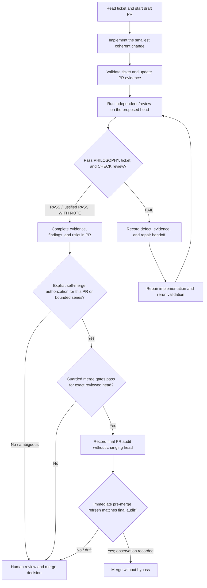

# Agent Implementation and Review Workflow

This document defines the required implementation, review, repair, and handoff
workflow for roadmap tickets. It tracks observable engineering work and
evidence, not agent runtime identity.

## Roles

### Implementation pass

The implementation pass is responsible for:

- reviewing the target ticket and its dependencies;
- making the smallest coherent change consistent with `PHILOSOPHY.md`;
- opening and continuously updating a draft PR;
- completing ticket-required validation and diagnosing implementation failures;
  and
- recording decisions, results, failures, and evidence in the PR.

### Review pass

After implementation, run `/review` as an independent pass, separate from the
implementation pass, on the proposed head.
The review is responsible for:

- checking the ticket goal, scope, dependencies, and acceptance criteria;
- checking alignment with `PHILOSOPHY.md`;
- selecting only the applicable sections of `CHECK.md`;
- reviewing correctness, the real data path, GPU/DGX Spark behavior,
  long-running operations, and research integrity where applicable;
- detecting unnecessary branches, duplicate paths, compatibility shims, and
  abstractions created only for hypothetical future use; and
- returning a justified `PASS`, `PASS WITH NOTE`, or `FAIL`.

The review must not execute every checklist item mechanically. It selects areas
affected by the change and explains why important unselected areas are `N/A`.
If `/review` is unavailable or returns no verdict, record the review as
`blocked` and prepare the complete review handoff; do not claim a passing
verdict.

### Repair pass

When a review returns `FAIL`, route the repair by defect type and preserve the
failed review in the PR. The repair request must include the evidence and the
constraints that the fix must preserve. Examples:

- local wiring or configuration omission: include the failing command and
  resolved configuration;
- cross-component responsibility or coupling: include the relevant ownership
  boundaries and required simplification;
- GPU, performance, or numerical behavior: include profiles, measurement
  conditions, and baseline deltas; and
- data semantics, leakage, or resume: include the failing sequence and
  manifest/cursor evidence.

After repair, rerun the affected validation and an independent `/review`.
Repeat until the result is `PASS` or an explicitly justified `PASS WITH NOTE`.

## Required flow

## Evidence rules

Record the following for each implementation, review, repair, and re-review
cycle:

- phase and input commit or diff identity;
- received context and requested work;
- outcome: implemented, `PASS`, `PASS WITH NOTE`, `FAIL`, or `blocked`;
- important findings and resulting changes;
- commands, measurements, and other supporting evidence; and
- unresolved risks.

Never erase a failed cycle. Do not claim access to hidden chain-of-thought;
observable rationale, changes, findings, and evidence are the useful record.

## Draft PR operation

The PR is a working surface during implementation, not a report written only
after the work ends.

1. Start a draft PR with the ticket, hypothesis, scope, and current plan.
2. Add configuration, failures, measurements, and direction changes while
   implementing.
3. Preserve review findings before resolving them.
4. After repair, record which finding was addressed and what evidence
   demonstrated resolution.
5. Complete the handoff with the final review verdict, unresolved risks, and
   decisions the human reviewer must make.

Use `.github/pull_request_template.md` for the PR body.

## Merge authority and guarded self-merge

Human review and merge is the default. An agent may self-merge only after a
human explicitly authorizes either the named PR or a bounded ticket/goal series.
Record the human instruction, its scope, and where it was given in the PR. Tool
access, PR authorship, a broad autonomy request, or a passing self-review does
not supply or expand that authority. When authorization is ambiguous,
superseded, or revoked, leave the PR for a human to merge.

Before an authorized self-merge, the merging agent audits the exact head and
records the result in the PR body or a PR comment. All of these gates must pass:

1. The latest independent `/review` result is `PASS` or a justified
   `PASS WITH NOTE` for that exact head commit.
2. Every actionable review finding was repaired and independently re-reviewed.
   No GitHub blocking review decision or `CHANGES_REQUESTED` review remains, and no newer
   human objection supersedes the authorization or passing review. An agent
   must not dismiss a human review to manufacture a clear decision.
3. All GitHub review threads are resolved. A note may remain only when it is
   explicitly non-actionable and documented as residual risk.
4. Inventory both branch-protection required contexts and applicable configured
   workflows/checks. Every expected check must be present and successful for
   the exact head. An expected check that is absent, pending, skipped,
   cancelled, or otherwise non-successful blocks merge. If no check is required,
   configured, or expected, record the inventory evidence and observed empty
   status; an empty status list alone is not evidence that the no-check case
   applies.
5. The PR is up to date with the target branch, conflict-free, and reported
   mergeable. If updating the branch changes the head, repeat the applicable
   validation and independent `/review` on the new head.
6. The PR implementation/review trail, validation evidence, risks, and
   authorization evidence are complete and consistent.
7. The change is outside every prohibited category below, and the merge requires
   no administrator action, protection bypass, force merge, or disabled check.
8. Immediately before invoking merge, re-fetch the human authorization, head
   and base SHAs, blocking review decision and newer human objections,
   unresolved threads, expected-check inventory and exact-head statuses, and
   mergeability. Compare them with the final audit and record the observation
   in the PR without changing the head. Any drift aborts the merge and triggers
   the appropriate branch update, validation, evidence update, or independent
   `/review`.

Self-merge is prohibited when the change contains or authorizes:

- secrets or security-control changes;
- publication of private data;
- a new paid resource;
- a destructive or unrecoverable action;
- an unresolved legal or licensing question; or
- another externally consequential protected action, including deployment,
  release, account or permission changes, or a non-routine external action
  outside ordinary repository collaboration. Routine PR/issue creation, review
  comments, evidence updates, and repository coordination remain allowed.

The final audit records the authorization scope, reviewed head SHA, review
verdict, blocking-review and newer-objection state, disposition of findings and
threads, required-context and configured-workflow inventories, observed
exact-head statuses, target/base state, mergeability, evidence parity,
prohibited-category result, and intended non-bypass merge method. Record it
without committing to the reviewed branch; otherwise the head changes and the
review gate must run again. The immediate pre-merge refresh is a separate final
observation of those mutable fields, also recorded without changing the head.

The bootstrap pull request that introduces this guarded self-merge policy cannot
use its contents or a broader series authorization to authorize or merge itself.
The preceding human-only policy governs until a human merges it.

## Failed-review handoff contract

A repair handoff must include at least:

- ticket, goal, in-scope work, and out-of-scope work;
- relevant principles from `PHILOSOPHY.md`;
- current commit/diff and resolved Hydra configuration;
- the implementation changes under review;
- selected `CHECK.md` sections and the exact item that caused `FAIL`;
- reproduction command, logs, metrics, traces, and relevant files;
- repair attempts already made and their results;
- invariants and constraints that must remain intact; and
- exact requested repair and completion evidence.

A handoff that says only "it did not work, fix it" is not sufficient. The repair
pass should not need to repeat the same investigation from scratch.

## Relationship to tests

The post-implementation review does not require generic unit tests by default.
Its focus is the real training path, ML semantics, GPU use, data supply,
numerical health, experiment integrity, and changeability.

This does not waive tests explicitly required by `ROADMAP.md` acceptance
criteria or the smallest fixture needed to demonstrate a mathematical or data
invariant.

## Completion rule

Do not mark a ticket complete until all of the following are true:

- the draft PR is current;
- the applicable `CHECK.md` review is complete;
- failed cycles and repair handoffs remain in the PR;
- the final verdict is `PASS` or a justified `PASS WITH NOTE`;
- the PR states unresolved risks and decisions for the human reviewer;
- the PR records merge authority as either `human merge` or an explicit,
  in-scope human authorization for guarded self-merge; and
- an authorized self-merge occurs only after the final exact-head audit above;
  otherwise the completed PR remains ready for a human merge.
