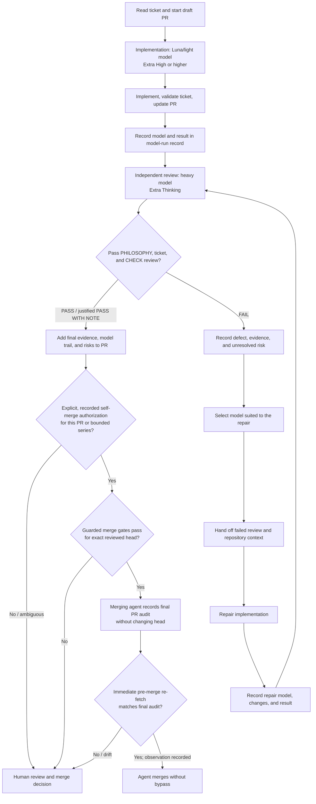

# Agent Implementation and Model Review Workflow

This document defines how to track which model implemented a roadmap ticket,
where it failed, and which context was passed to the next model for repair.

The goal is not to rank models for its own sake. The history should improve
future model selection by showing implementation speed, first-review pass rate,
the kinds of problems each model detects or misses, repair success, and
tendencies toward unnecessary complexity.

## Roles

### Implementation model

By default, use Luna or the available lightweight implementation model at
`Extra High` reasoning or higher for the first implementation pass.

The implementation model is responsible for:

- reviewing the target ticket and its dependencies
- making the smallest coherent change consistent with `PHILOSOPHY.md`
- opening and continuously updating a draft PR
- completing ticket-required validation and diagnosing failures found during implementation
- recording implementation decisions, results, and evidence in the model-run record

### Review model

After implementation, use an available heavier model at `Extra Thinking` for a
review pass that is independent from the implementation pass.

If the current runtime cannot select a heavier model or `Extra Thinking`, mark
the review `blocked` and prepare the required context. Do not treat the
implementation model's self-review as a passing independent heavy-model review.

The review model is responsible for:

- checking alignment with the ticket goal, scope, and acceptance criteria
- checking alignment with `PHILOSOPHY.md`
- selecting only the applicable sections of `CHECK.md`
- reviewing correctness, the real data path, GPU/DGX Spark behavior,
  long-running operations, and research integrity
- detecting unnecessary branches, duplicate paths, compatibility shims, and
  abstractions created only for hypothetical future use
- recording a justified `PASS`, `PASS WITH NOTE`, or `FAIL`

The review model must not execute every checklist item mechanically. It selects
areas affected by the change and explains why major unselected areas are `N/A`.

### Repair model

When the review returns `FAIL`, choose the next implementation model based on
the failure type. Reusing the same model is allowed, but it must be a deliberate
choice with a recorded reason.

Examples:

- Local wiring or config omission: return a precise repair request to a
  lightweight implementation model.
- Cross-component responsibility or coupling: hand off to a model suited to
  stronger design reasoning.
- GPU, performance, or numerical behavior: use a model that can interpret
  profiles, measurement conditions, and baseline deltas.
- Data semantics, leakage, or resume: include the failing sequence and
  manifest/cursor evidence in the handoff context.

## Required flow

## Model identity rules

Record the following for every phase:

- exact model identifier displayed by the runtime
- reasoning or thinking mode
- role: `implementation`, `review`, or `repair`
- starting commit or diff identity
- received context and request
- outcome: `implemented`, `PASS`, `PASS WITH NOTE`, `FAIL`, or `blocked`
- important findings, changes, evidence, and unresolved risks

Never infer an identifier from model behavior or conversation. Write
`not exposed by runtime` when the runtime does not display it. If both a
marketing name and an API model ID are visible, retain both.

Use `scripts/capture_model_provenance.py` for a machine-readable capture. Keep
`requested` (explicit invocation or config defaults) separate from `actual`
(active runtime display). The current Codex session visibly identifies the
product as `Codex` and the family as `GPT-5`, while exact deployment ID and
reasoning mode are unavailable; record those unavailable fields with a reason.
Source precedence is runtime display, explicit invocation metadata, config
defaults, then unavailable. A child agent records its own capture and must not
inherit the parent's identity. The capture is redaction-safe: no prompts,
hidden chain-of-thought, tokens, secrets, or raw thread IDs.

Hidden chain-of-thought is not part of the record. The useful comparison data
is the input context, observable engineering rationale, changes, findings,
evidence, and outcome.

## Draft PR operation

The PR is a working surface during implementation, not a report written only
after the work ends.

1. Start a draft PR with the ticket, hypothesis, scope, and implementation model.
2. Add config, failures, measurements, and direction changes while implementing.
3. Preserve review-model findings in the model-run record before resolving them.
4. After repair, record which model addressed which finding and what evidence
   demonstrated resolution.
5. Complete the handoff with the final review verdict, unresolved risks, and
   decisions the human reviewer must make.

Use `.github/pull_request_template.md` for the PR body.

## Merge authority and guarded self-merge

Human review and merge is the default. An agent may self-merge only after a
human explicitly authorizes either the named PR or a bounded ticket/goal series.
Record the human instruction, its scope, and where it was given in the PR and
model-run record. Tool access, PR authorship, a broad autonomy request, or the
implementation agent's own review does not supply or expand that authority.
When authorization is ambiguous, superseded, or revoked, leave the PR for a
human to merge.

Before an authorized self-merge, the merging agent audits the exact head and
records the result in the PR body or a PR comment. All of these gates must pass:

1. The latest independent review is `PASS` or a justified `PASS WITH NOTE` for
   that exact head commit.
2. Every actionable review finding was repaired and independently re-reviewed.
   No GitHub blocking review decision or `CHANGES_REQUESTED` review remains, and
   no newer human objection supersedes the authorization or passing review. An
   agent must not dismiss a human review to manufacture a clear decision.
3. All GitHub review threads are resolved. A note may remain only when it is
   explicitly non-actionable and documented as residual risk.
4. Inventory both branch-protection required contexts and applicable configured
   workflows/checks. Every expected check must be present and successful for the
   exact head. An expected check that is absent, pending, skipped, cancelled, or
   otherwise non-successful blocks merge. If no check is required, configured,
   or expected, record the inventory evidence and the observed empty status;
   an empty status list alone is not evidence that the no-check case applies.
5. The PR is up to date with the target branch, conflict-free, and reported
   mergeable. If updating the branch changes the head, repeat the applicable
   validation and independent review on the new head.
6. The model-run record, ledger row and aggregate, PR model trail, validation
   evidence, risks, and authorization evidence are complete and consistent.
7. The change is outside every prohibited category below, and the merge requires
   no administrator action, protection bypass, force merge, or disabled check.
8. Immediately before invoking merge, re-fetch the human authorization, head and
   base SHAs, blocking review decision and newer human objections, unresolved
   threads, expected-check inventory and exact-head statuses, and mergeability.
   Compare them with the final audit and record the observation in the PR without
   changing the head. Any drift aborts the merge and triggers the
   appropriate branch update, validation, evidence update, or independent
   re-review before the gates are evaluated again.

Self-merge is prohibited when the change contains or authorizes:

- secrets or security-control changes;
- publication of private data;
- a new paid resource;
- a destructive or unrecoverable action;
- an unresolved legal or licensing question; or
- another externally consequential protected action, including deployment,
  release, account or permission changes, or a non-routine external action
  outside ordinary repository collaboration. Routine PR/issue creation, review
  comments, evidence updates, and repository coordination remain allowed.

The final audit records the authorization scope, reviewed head SHA, independent
verdict, blocking-review and newer-objection state, disposition of findings and
threads, required-context and configured-workflow inventories, observed
exact-head statuses, target/base state, mergeability, artifact parity,
prohibited-category result, and intended non-bypass merge method. Record it
without committing to the reviewed branch; otherwise the head changes and the
review gate must run again. The immediate pre-merge refresh is a separate final
observation of those same mutable fields, also recorded without changing head.

The PR that introduces this policy cannot use it to authorize or merge itself.
The repository's preceding human-only rule remains in force until a human merges
that bootstrap PR.

## Failed-review handoff contract

Context passed to the next model must include at least:

- ticket, goal, in-scope work, and out-of-scope work
- relevant principles from `PHILOSOPHY.md`
- current commit/diff and resolved Hydra config
- implementation model and the changes it made
- review model and selected `CHECK.md` sections
- the exact item that caused `FAIL`
- reproduction command, logs, metrics, traces, and relevant files
- repair attempts already made and their results
- invariants and constraints that must remain intact
- exact requested repair and completion evidence

A handoff that says only "it did not work, fix it" is not sufficient. The next
model should not need to repeat the same investigation from scratch.

## Relationship to tests

The post-implementation review in this workflow does not require generic unit
tests by default. Its focus is the real training path, ML semantics, GPU use,
data supply, numerical health, experiment integrity, and changeability.

This does not waive tests explicitly required by `ROADMAP.md` acceptance
criteria or the smallest fixture needed to demonstrate a mathematical or data
invariant.

## Completion rule

Do not mark a ticket complete until all of the following are true:

- the draft PR is current
- every implementation, review, and repair model is recorded
- the applicable `CHECK.md` review is complete
- failed cycles and repair handoffs remain in the record
- the final verdict is `PASS` or a justified `PASS WITH NOTE`
- the detailed record and `docs/model-runs/README.md` aggregate are updated
- the PR states unresolved risks and decisions for the human reviewer
- the PR records merge authority as either `human merge` or an explicit,
  in-scope human authorization for guarded self-merge
- an authorized self-merge occurs only after the final exact-head audit above;
  otherwise the completed PR remains ready for a human merge
